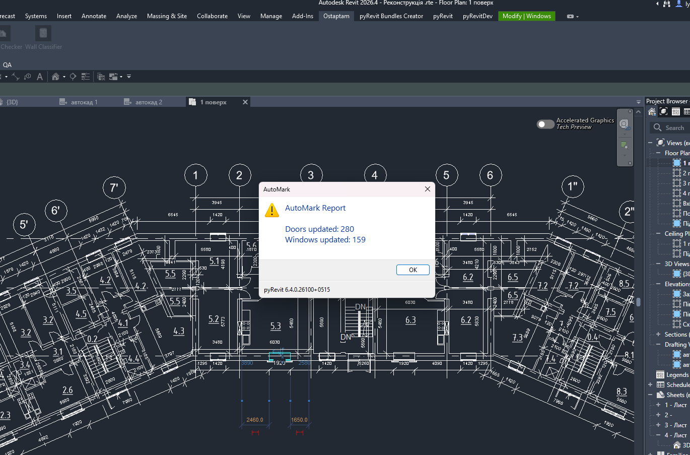

# AutoMark for pyRevit

Automatic numbering tool for doors and windows in Revit using pyRevit and Python.

## Overview

AutoMark automatically assigns Mark values to doors and windows based on:

- Level
- Element coordinates
- Sequential numbering

Example output:

- D-01-001
- D-01-002
- W-02-001

The tool groups elements by level and numbers them in a consistent order.

## Features

- Automatic door numbering
- Automatic window numbering
- Level-based grouping
- Coordinate-based sorting
- WPF user interface
- Batch parameter editing

## Interface

### Run Window

### Result Example

## Tech Stack

- Python
- pyRevit
- Revit API
- WPF / XAML
